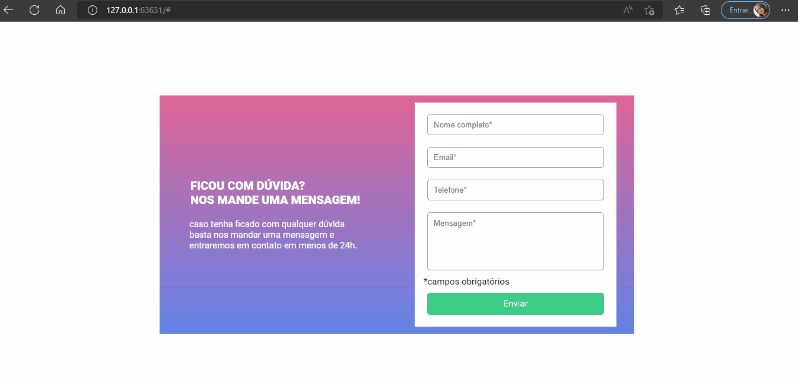

#### Criar um Formulário com validação

#### Pontos de Atenção:

##### A validação do formulário deve ser feita com javascript puro.
##### Ao clicar para enviar o formulário, se caso algum campo não estiver preenchido, a borda do input deve ficar vermelha e uma mensagem de "campo obrigatório" deve aparecer embaixo do campo que não foi preenchido. 
##### Quando um campo for preenchido, na mesma hora a borda do input deve ficar verde e o texto "campo obrigatório" deve sumir.

[]

[]

[]

[]

#### Tecnologias utilizadas

  
    
  
  